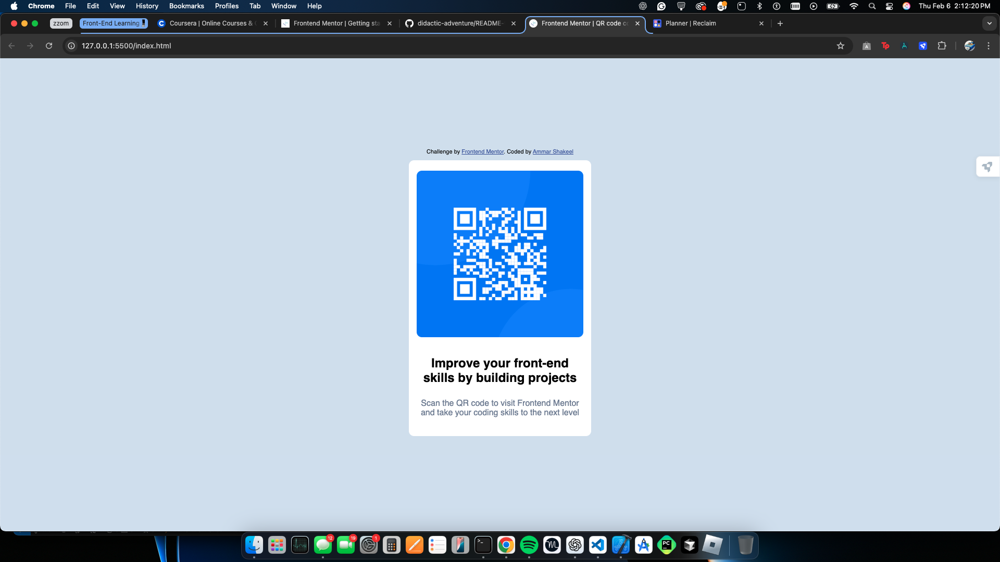

# Frontend Mentor - QR code component solution

This is a solution to the [QR code component challenge on Frontend Mentor](https://www.frontendmentor.io/challenges/qr-code-component-iux_sIO_H). Frontend Mentor challenges help you improve your coding skills by building realistic projects. 

## Table of contents

- [Overview](#overview)
  - [Screenshot](#screenshot)
  - [Links](#links)
- [My process](#my-process)
  - [Built with](#built-with)
  - [What I learned](#what-i-learned)
  - [Continued development](#continued-development)
  - [Useful resources](#useful-resources)
- [Author](#author)
- [Acknowledgments](#acknowledgments)

## Overview

### Screenshot



### Links

- Solution URL: [Add solution URL here](https://github.com/ammarshakeel1/didactic-adventure/tree/main)
- Live Site URL: [Add live site URL here](https://ammarshakeel1.github.io/didactic-adventure/)

## My process

### Built with

- Semantic HTML5 markup
- CSS custom properties
- Flexbox
- CSS Grid
- Mobile-first workflow
- [Styled Components](https://styled-components.com/) - For styles

### What I learned

This is my first try actually applying the things I learn online about web development, I learned a lot, such as the importance of properly structuring HTML code to setup for easy CSS styling. My biggest challenge was just remembering the different commands and such that I could use to complete the work. 

Took me a while to figure it out (I know should be very obvious haha) but I was having a hard time trying to properply format the card because the image was so big and I kept trying to do something in the body selector to fix it, turns out it was just as simple as chaging the image size directly, and from here it was smooth sailing.


```css
.QR-card img {
    max-width: 100%;
    height: auto;
    border-radius: 10px;
    margin-bottom: 20px;
}
```

### Continued development

Another challenge I had was that my CSS code stopped updating on my live server, and after troubleshooting for a while I ended up deleting all the code and rewriting the whole thing, which isn't a sustainable thing to do so in the future I'd want to be able to correctly identify issues in my project.

### Useful resources

- [W3 Schools](https://www.w3schools.com/html/html_css.asp) - This resource helped me a ton because this is my first time actually applying anything I learned, I was forgetting a lot of different things to use and looking things up in this website really helped out in jogging my memory.

## Author

- LinkedIn - [Ammar Shakeel](www.linkedin.com/in/ammar-shakeel-69436b282)
- Frontend Mentor - [@yourusername](https://www.frontendmentor.io/profile/ammarshakeel1)

